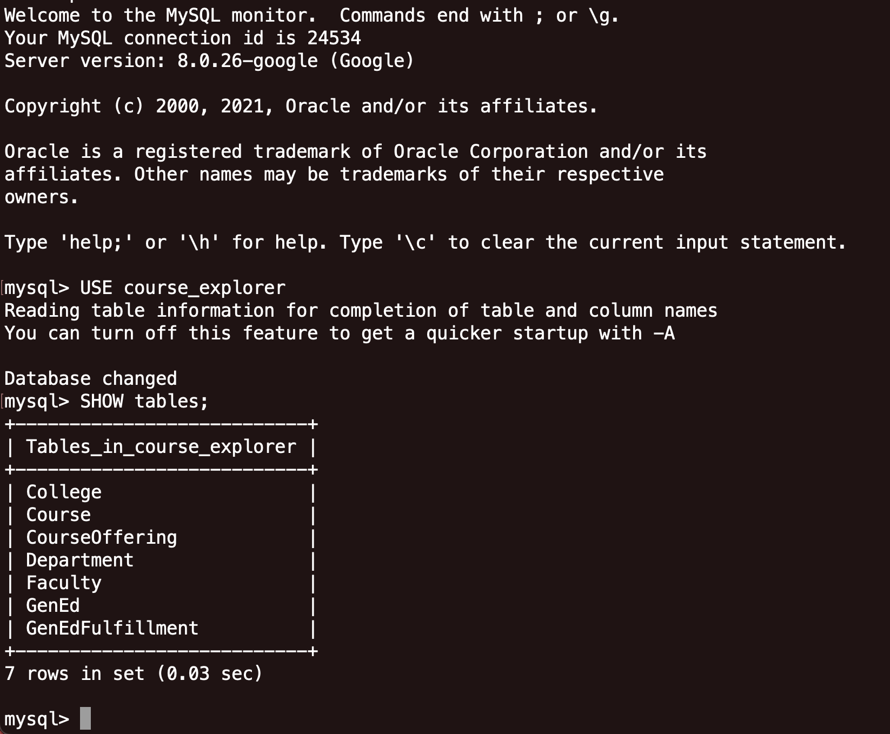
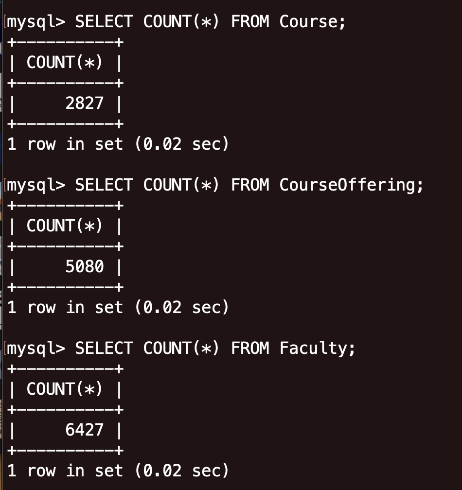
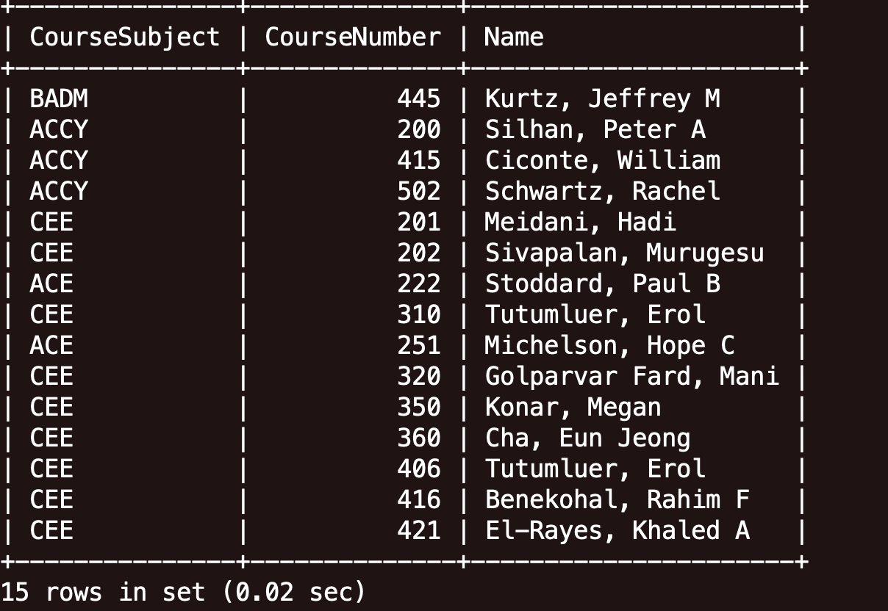
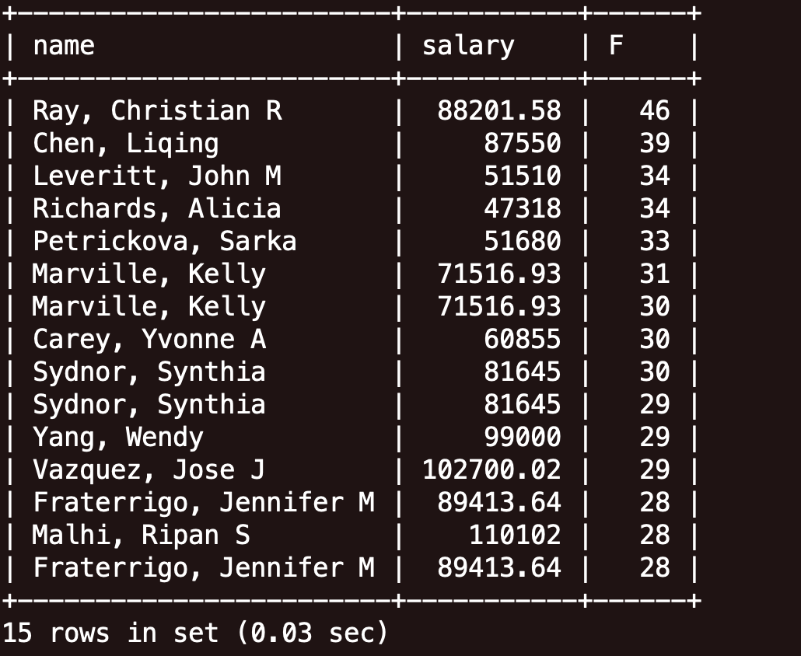

# Database Design

## Database Implementation
### Setup GCP


### Setup Tables
```SQL
CREATE DATABASE course_explorer;

CREATE TABLE Course (
    Subject VARCHAR(5),
    Number INT,
    Name VARCHAR(255),
    Description TEXT,
    CreditHours VARCHAR(15),
    PRIMARY KEY(Subject, Number)
);

CREATE TABLE Faculty(
    Name VARCHAR(225) NOT NULL PRIMARY KEY,
    Salary REAL,
    DepartmentCode INT,
    CollegeCode VARCHAR(5),

    FOREIGN KEY (DepartmentCode) REFERENCES Department(DepartmentCode),
    FOREIGN KEY (CollegeCode) REFERENCES College(CollegeCode)
);

CREATE TABLE College (
    CollegeCode VARCHAR(5) NOT NULL PRIMARY KEY,
    CollegeName VARCHAR(225)
);

CREATE TABLE Department (
    DepartmentCode INT NOT NULL PRIMARY KEY,
    DepartmentName VARCHAR(255)
);

CREATE TABLE GenEd (
    Abbreviation VARCHAR(5) NOT NULL PRIMARY KEY
);

CREATE TABLE CourseOffering(
    Yr INT,
    Term VARCHAR(10),
    CourseSubject VARCHAR(5),
    CourseNumber INT,
    Ap INT,
    A INT,
    Am INT,
    Bp INT,
    B INT,
    Bm INT,
    Cp INT,
    C INT,
    Cm INT,
    Dp INT,
    D INT,
    Dm INT,
    F INT,
    W INT,
    PrimaryInstructor VARCHAR(255),
    CRN INT,
    SectionNumber VARCHAR(5),
    StartTime TIME,
    EndTime TIME,
    DaysOfWeek VARCHAR(10),
    Buliding VARCHAR(255),
    Room VARCHAR(10),

    PRIMARY KEY (Yr, Term, CRN),
    FOREIGN KEY (CourseSubject, CourseNumber) REFERENCES Course(Subject, Number)
    FOREIGN KEY (PrimaryInstructor) REFERENCES Faculty(Name)
);


CREATE TABLE GenEdFulfillment(
    CourseNumber INT,
    CourseSubject VARCHAR(5),
    GenEdAbbreviation VARCHAR(5),

    FOREIGN KEY (CourseSubject, CourseNumber) REFERENCES Course(Subject, Number),
    FOREIGN KEY (GenEdAbbreviation) REFERENCES GenEd(Abbreviation)
);
```

### At least 1000 rows in three tables


## Advanced Queries
### Query 1: Course taught by well-paid instructors

```SQL
SELECT c.CourseSubject, c.CourseNumber, rich.Name
FROM CourseOffering c
JOIN (
	SELECT Name
	FROM Faculty
	WHERE Salary > 50000
    ) AS rich ON c.PrimaryInstructor = rich.Name
WHERE Yr > 2015 AND Term = "FALL"
```



### Query 2: Instructors by grades given
An example of a query we would make on the Faculty table filters the output by the grades they give in each course section. Here, we find all professors who give at least 5 F's and fewer than 10 A's.

```SQL
SELECT f.name, f.salary, failProfs.F
FROM Faculty f
JOIN (
	SELECT PrimaryInstructor, F
	FROM CourseOffering
	WHERE F > 5 AND A + Ap + Am < 10
    ) AS failProfs ON f.Name = failProfs.PrimaryInstructor
ORDER BY failProfs.F DESC
```



## Indexing
### Index on salary and year

```SQL
CREATE INDEX salary_idx ON Faculty(Salary);
CREATE INDEX year_idx ON CourseOffering(Yr);
```
### Index on Term
```SQL
CREATE INDEX term_idx ON CourseOffering(Term);
```

### Before Indexing
```
-> Nested loop inner join  (cost=572.27 rows=81) (actual time=0.118..7.459 rows=1577 loops=1)
    -> Filter: ((c.Term = 'FALL') and (c.Yr > 2015) and (c.PrimaryInstructor is not null))  (cost=487.50 rows=242) (actual time=0.104..3.517 rows=1668 loops=1)
        -> Index range scan on c using PRIMARY  (cost=487.50 rows=2422) (actual time=0.097..2.735 rows=5080 loops=1)
    -> Filter: ((c.PrimaryInstructor = Faculty.`Name`) and (Faculty.Salary > 50000))  (cost=0.25 rows=0) (actual time=0.002..0.002 rows=1 loops=1668)
        -> Single-row index lookup on Faculty using PRIMARY (Name=c.PrimaryInstructor)  (cost=0.25 rows=1) (actual time=0.002..0.002 rows=1 loops=1668)

```

### After Indexing by Salary and Year
```
-> Nested loop inner join  (cost=572.27 rows=121) (actual time=0.156..7.177 rows=1577 loops=1)
    -> Filter: ((c.Term = 'FALL') and (c.Yr > 2015) and (c.PrimaryInstructor is not null))  (cost=487.50 rows=242) (actual time=0.141..3.484 rows=1668 loops=1)
        -> Index range scan on c using PRIMARY  (cost=487.50 rows=2422) (actual time=0.132..2.713 rows=5080 loops=1)
    -> Filter: ((c.PrimaryInstructor = Faculty.`Name`) and (Faculty.Salary > 50000))  (cost=0.25 rows=0) (actual time=0.002..0.002 rows=1 loops=1668)
        -> Single-row index lookup on Faculty using PRIMARY (Name=c.PrimaryInstructor)  (cost=0.25 rows=1) (actual time=0.001..0.002 rows=1 loops=1668)

```
### After Indexing by Term  
```
-> Nested loop inner join  (cost=911.35 rows=404) (actual time=0.281..7.475 rows=1577 loops=1)
    -> Filter: ((c.Term = 'FALL') and (c.Yr > 2015) and (c.PrimaryInstructor is not null))  (cost=487.50 rows=1211) (actual time=0.125..3.541 rows=1668 loops=1)
        -> Index range scan on c using PRIMARY  (cost=487.50 rows=2422) (actual time=0.118..2.741 rows=5080 loops=1)
    -> Filter: ((c.PrimaryInstructor = Faculty.`Name`) and (Faculty.Salary > 50000))  (cost=0.25 rows=0) (actual time=0.002..0.002 rows=1 loops=1668)
        -> Single-row index lookup on Faculty using PRIMARY (Name=c.PrimaryInstructor)  (cost=0.25 rows=1) (actual time=0.002..0.002 rows=1 loops=1668)

```

### Optimized Indexing
```
-> Nested loop inner join  (cost=572.27 rows=121) (actual time=0.156..7.177 rows=1577 loops=1)
    -> Filter: ((c.Term = 'FALL') and (c.Yr > 2015) and (c.PrimaryInstructor is not null))  (cost=487.50 rows=242) (actual time=0.141..3.484 rows=1668 loops=1)
        -> Index range scan on c using PRIMARY  (cost=487.50 rows=2422) (actual time=0.132..2.713 rows=5080 loops=1)
    -> Filter: ((c.PrimaryInstructor = Faculty.`Name`) and (Faculty.Salary > 50000))  (cost=0.25 rows=0) (actual time=0.002..0.002 rows=1 loops=1668)
        -> Single-row index lookup on Faculty using PRIMARY (Name=c.PrimaryInstructor)  (cost=0.25 rows=1) (actual time=0.001..0.002 rows=1 loops=1668)
```

### Analysis on Index
After examining the indices, we decided to index on Salary and Year. We decided to do this because when we compared the cost of the query to the baseline there is no difference, while the index by term increased the cost by several hundred. We hypothesize that there is no difference from the baseline because the work of the query is evenly split between searching for salaries that meet the threshold and by joining the table based on the primary key. Regardless, we are going to index by Salary and Year because we think that there will be benefits on future queries we will design.

## Index
Index on number of F's given

```SQL
CREATE INDEX f_index ON CourseOffering(F);
CREATE INDEX ap_index ON CourseOffering(Ap);
CREATE INDEX a_index ON CourseOffering(A);
CREATE INDEX am_index ON CourseOffering(Am);
```

### Before Indexing
```
-> Nested loop inner join  (cost=1395.68 rows=4844) (actual time=3.362..3.381 rows=6 loops=1)
    -> Sort: CourseOffering.F DESC  (cost=507.65 rows=4844) (actual time=3.321..3.322 rows=6 loops=1)
        -> Filter: ((CourseOffering.F > 5) and (((CourseOffering.A + CourseOffering.Ap) + CourseOffering.Am) < 10) and (CourseOffering.PrimaryInstructor is not null))  (cost=507.65 rows=4844) (actual time=0.433..3.299 rows=6 loops=1)
            -> Table scan on CourseOffering  (cost=507.65 rows=4844) (actual time=0.168..2.959 rows=5080 loops=1)
    -> Filter: (f.`Name` = CourseOffering.PrimaryInstructor)  (cost=0.25 rows=1) (actual time=0.009..0.009 rows=1 loops=6)
        -> Single-row index lookup on f using PRIMARY (Name=CourseOffering.PrimaryInstructor)  (cost=0.25 rows=1) (actual time=0.008..0.008 rows=1 loops=6)
```

### After Indexing by F
```
-> Nested loop inner join  (cost=227.46 rows=284) (actual time=0.390..0.920 rows=6 loops=1)
    -> Filter: ((((CourseOffering.A + CourseOffering.Ap) + CourseOffering.Am) < 10) and (CourseOffering.PrimaryInstructor is not null))  (cost=128.06 rows=284) (actual time=0.369..0.875 rows=6 loops=1)
        -> Index range scan on CourseOffering using f_index, with index condition: (CourseOffering.F > 5)  (cost=128.06 rows=284) (actual time=0.346..0.842 rows=284 loops=1)
    -> Filter: (f.`Name` = CourseOffering.PrimaryInstructor)  (cost=0.25 rows=1) (actual time=0.007..0.007 rows=1 loops=6)
        -> Single-row index lookup on f using PRIMARY (Name=CourseOffering.PrimaryInstructor)  (cost=0.25 rows=1) (actual time=0.006..0.006 rows=1 loops=6)

```
### After Indexing by Ap
```
-> Nested loop inner join  (cost=1395.68 rows=4844) (actual time=3.188..3.210 rows=6 loops=1)
    -> Sort: CourseOffering.F DESC  (cost=507.65 rows=4844) (actual time=3.151..3.152 rows=6 loops=1)
        -> Filter: ((CourseOffering.F > 5) and (((CourseOffering.A + CourseOffering.Ap) + CourseOffering.Am) < 10) and (CourseOffering.PrimaryInstructor is not null))  (cost=507.65 rows=4844) (actual time=0.386..3.134 rows=6 loops=1)
            -> Table scan on CourseOffering  (cost=507.65 rows=4844) (actual time=0.103..2.798 rows=5080 loops=1)
    -> Filter: (f.`Name` = CourseOffering.PrimaryInstructor)  (cost=0.25 rows=1) (actual time=0.009..0.009 rows=1 loops=6)
        -> Single-row index lookup on f using PRIMARY (Name=CourseOffering.PrimaryInstructor)  (cost=0.25 rows=1) (actual time=0.008..0.008 rows=1 loops=6)
```

### After Indexing by A
```
-> Nested loop inner join  (cost=1395.68 rows=4844) (actual time=3.210..3.230 rows=6 loops=1)
    -> Sort: CourseOffering.F DESC  (cost=507.65 rows=4844) (actual time=3.183..3.184 rows=6 loops=1)
        -> Filter: ((CourseOffering.F > 5) and (((CourseOffering.A + CourseOffering.Ap) + CourseOffering.Am) < 10) and (CourseOffering.PrimaryInstructor is not null))  (cost=507.65 rows=4844) (actual time=0.355..3.168 rows=6 loops=1)
            -> Table scan on CourseOffering  (cost=507.65 rows=4844) (actual time=0.083..2.823 rows=5080 loops=1)
    -> Filter: (f.`Name` = CourseOffering.PrimaryInstructor)  (cost=0.25 rows=1) (actual time=0.007..0.007 rows=1 loops=6)
        -> Single-row index lookup on f using PRIMARY (Name=CourseOffering.PrimaryInstructor)  (cost=0.25 rows=1) (actual time=0.006..0.006 rows=1 loops=6)
```

### Analysis on Index

Indexing on Am gives the same results as above. This is likely because our query filters by the sum of Ap, A, and Am rather than the individual columns themselves. 

From the results above, we see that indexing on F gives significant reduction in cost. Because we plan to offer our user the ability fo filter instructors by specific grades, and indexing on F gives the greatest performance benefit, we will create an index on `F` in `CourseOffering`: 
```SQL
CREATE INDEX f_index ON CourseOffering(F);
```
