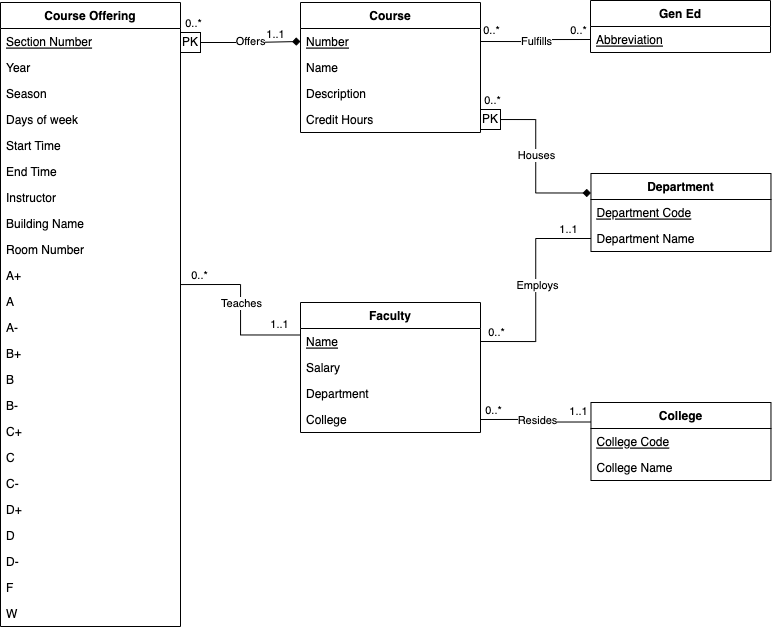

# UML Diagram


# Relational Schema
```
Course(
    Department Code: INT [PK] [FK to Department.DepartmentCode] 
    Number: INT [PK], 
    Name: VARCHAR(225),
    Description: TEXT,
    Credit Hours: VARCHAR(15)
)

Faculty(
    Name: VARCHAR(225) [PK],
    Department Code: INT [FK to Department.DepartmentCode],
    College Code: VARCHAR(5) [FK to College.CollegeCode]
    Salary: REAL,
)

College(
    College Code: VARCHAR(5) [PK],
    College Name: VARCHAR(255)
)

Department(
    Department Code: INT [PK],
    Department Name: VARCHAR(255)
)

GenEd(
    Abbreviation: VARCHAR(5) [PK],
)

Course Offering(
    Course Department Code: INT [FK to Course.CourseDepartmentCode],
    Course Number: INT [FK to Course.CourseNumber],
    CRN: INT [PK]
    Section Number: VARCHAR(5),
    Year: INT [PK],
    Season: VARCHAR(10) [PK],
    Days of Week: VARCHAR(10),
    Start Time: TIME,
    End Time: TIME,
    Instructor Name: VARCHAR(255) [FK to Instructor.Name],
    Buliding Name: VARCHAR(255) [FK to Building.Name],
    Room Number: VARCHAR(10)
    A+: INT,
    A: INT,
    A-: INT,
    B+: INT,
    B: INT,
    B-: INT,
    C+: INT,
    C: INT,
    C-: INT,
    D+: INT,
    D: INT,
    D-: INT,
    F: INT,
    W: INT
)

GenEdFulfillment(
    Course Number: INT [FK to Course.Number],
    Course Department Code: INT [FK to Course.DepartmentCode],
    Abbreviation: VARCHAR(5) [FK to GenEd.Relationships],
)
```

# Assumptions and Relationship Descriptions
* Course: We assume that a course can be uniquely identified by its number and the department it is housed in. Each course only has one department, but a department can have multiple or no courses. This comes from the fact that our data includes departments that employ faculty but do not offer classes (such as sports teams). A course may satisfy many or no general education requirements, and may be offered many or no times. Credit hours will be listed in the database as "3 or 4 credits" and similar forms of text.
* Faculty: We assume that the instructor name is unique. Since our data provides the full first, middle, and last name of the faculty we think this is a fine assumption. Our data also does not provide us the employee's NetId, so we cannot use that. The faculty can only belong to one college and one department, and they can teach many or no courses.
* College: Each college has a short unique code that is filled with either numbers or text. There is also a name for each college. Colleges can have many or no faculty.
* Department: Each department has a short unique numerical code. There is also a name for each department. Departments can have many or no faculty.
* GenEd: General education requirements are just a list of abbreviations for the requirement. A requirement can be applied to many or no courses.
* Course Offering: The course offering is uniquely determined by the CRN, year, and season it is offered in. The course offering is also tied to exactly 1 course. We assume that only 1 professor teaches a course. All the A+ through W entries denote the number of students recieved each grade. We represent days of the week in "MTWTHR" format.
