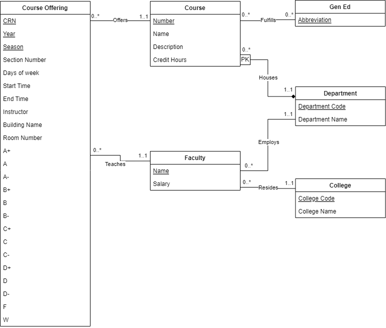

# UML Diagram


# Relational Schema
```
Course(
    Department Code: INT [PK] [FK to Department.DepartmentCode] 
    Number: INT [PK], 
    Name: VARCHAR(225),
    Description: TEXT,
    Credit Hours: VARCHAR(15)
)

Faculty(
    Name: VARCHAR(225) [PK],
    Department Code: INT [FK to Department.DepartmentCode],
    College Code: VARCHAR(5) [FK to College.CollegeCode]
    Salary: REAL,
)

College(
    College Code: VARCHAR(5) [PK],
    College Name: VARCHAR(255)
)

Department(
    Department Code: INT [PK],
    Department Name: VARCHAR(255)
)

GenEd(
    Abbreviation: VARCHAR(5) [PK],
)

Course Offering(
    Course Department Code: INT [FK to Course.CourseDepartmentCode],
    Course Number: INT [FK to Course.CourseNumber],
    Section Number: VARCHAR(5) [PK],
    Year: INT,
    Season: VARCHAR(10),
    Days of Week: VARCHAR(10),
    Start Time: TIME,
    End Time: TIME,
    Instructor Name: VARCHAR(255) [FK to Instructor.Name],
    Buliding Name: VARCHAR(255) [FK to Building.Name],
    Room Number: VARCHAR(10)
    A+: INT,
    A: INT,
    A-: INT,
    B+: INT,
    B: INT,
    B-: INT,
    C+: INT,
    C: INT,
    C-: INT,
    D+: INT,
    D: INT,
    D-: INT,
    F: INT,
    W: INT
)

GenEdFulfillment(
    Course Number: INT [FK to Course.Number],
    Course Department Code: INT [FK to Course.DepartmentCode],
    Abbreviation: VARCHAR(5) [FK to GenEd.Relationships],
)
```

# Assumptions
* Assume Instructor name is unique
* Only 1 instructor per course